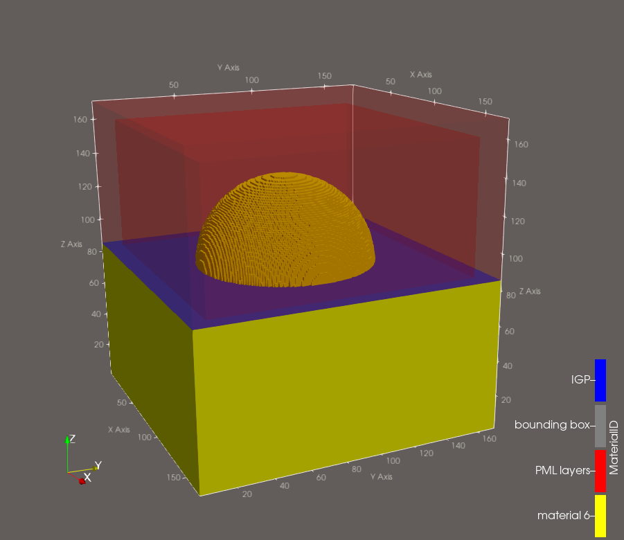
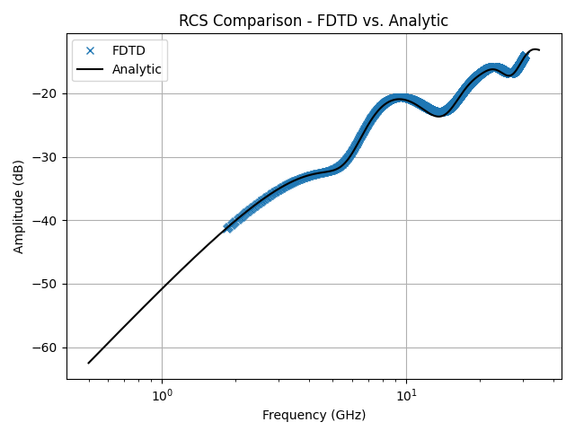

# Monostatic RCS of a PEC Half-sphere Mounted Over an Infinite Ground Plane (AlpineEM FDTD)

This example uses AlpineEM to run FDTD simulations that calculate the monostatic radar cross section (RCS) of a near-PEC (metal) half-sphere with a 12.5 mm radius, mounted over an infinite ground plane (IGP). The angle of incidence is normal to the ground plane. The simulations output time-domain data for post-processing, along with binary geometry files for three cases: **object** (sphere present), **clear** (sphere absent), and **clear with no IGP** (sphere and IGP absent).

This example is designed to teach and validate the core mechanisms of the solver, including the Total Field / Scattered Field (TF/SF) formalism, the convolutional perfectly matched layer (CPML) boundaries, the Near-to-Far-Field transformation (NTFF), and the IGP conditioning. It also covers the three build options: single-threaded CPU, multi-threaded CPU (OpenMP), and GPU (OpenACC).

## Workflow

### 1. Compile the FDTD solver

Choose one of three build options, depending on the resources available to you:

- **Single-threaded CPU**
- **Multi-threaded CPU** (OpenMP)
- **GPU** (OpenACC)

Batch scripts are included for building each version (`compile.sh`, `compile_mp.sh`, and `compile_acc.sh`).

### 2. Run the object case: `master.py`

Configures and runs the simulation with the sphere present.

- Generates a text file of inputs, then executes the binary compiled in Step 1.
- You must set the solver name in `master.py` (the GPU/OpenACC version is selected by default).
- Produces several output files used for post-processing and geometry viewing.

  > **Note:** To view the geometry (see Step 6) before running a full simulation, run for zero time steps.

### 3. Run the clear case: `master_clear.py`

Performs the same steps as `master.py`, but without the sphere present, to establish the reference (background) fields.

- You must set the solver name in `master_clear.py` (the GPU/OpenACC version is selected by default).
- Produces several output files used for post-processing and geometry viewing.

### 4. Run the clear case with no IGP: `master_clear_no_IGP.py`

Performs the same steps as `master.py`, but without the sphere or the infinite ground plane present, to establish the incident fields.

- You must set the solver name in `master_clear_no_IGP.py` (the GPU/OpenACC version is selected by default).
- Produces several output files used for post-processing and geometry viewing.

### 5. Post-process: `post_processor.py`

Combines the object and clear case outputs to generate RCS data as a `.csv` file.

- Example Slurm batch scripts are included and can be adapted to your cluster environment.

### 6. (Optional) View the geometry

To visualize the simulation geometry:

1. Run `fdtd_geometry_maker.py` to generate ParaView files. It reads the FDTD inputs file and the corresponding geometry binary to create them.
2. Open the resulting **single** ParaView file directly in ParaView. It references an accompanying folder of associated files, so leave that folder in place and do not open its contents individually.
3. For an easier setup, load the included macro, `fdtd_macro.py`, into ParaView (**Macros** tab) to automatically configure common viewing filters.

  

### 7. Validation

Use `plot.py` to compare the FDTD result with the analytic result. The two show good agreement, with a maximum error of around 0.75 dB. The disagreements at higher frequencies are largely due to the staircasing effect. Because the angle of incidence is normal to the IGP surface, the RCS response is identical to the linear combination of the forward and back scattering of a full sphere in free space:

## Performance reference

Approximate runtimes per simulation, measured on the author's hardware:

| Solver                      | Time per simulation |
|-----------------------------|---------------------|
| OpenACC (GPU)               | ~30 seconds         |
| OpenMP (multi-threaded CPU) | ~4 minutes          |
| Single-threaded (default)   | ~8 minutes          |

> **Note:** These timings depend heavily on hardware, problem size, and system load. Use them only as a rough point of reference, not as a direct benchmark against other software.
