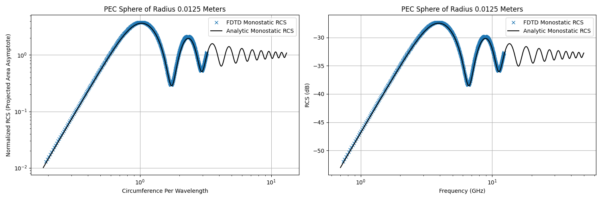

# Monostatic RCS of a PEC Sphere (AlpineEM FDTD)

This example uses AlpineEM to perform FDTD simulations that calculate the monostatic radar cross section (RCS) of a near-PEC (metal) sphere with a 12.5 mm radius. It outputs time-domain data for post-processing, along with binary geometry files for both the **object** (sphere present) and **clear** (sphere absent) cases.

## Workflow

### 1. Compile the FDTD solver

Choose one of three build options depending on the resources available to you:

- **Single-threaded CPU**
- **Multi-threaded CPU** (OpenMP)
- **GPU** (OpenACC)

### 2. Run the object case — `master.py`

Configures and runs the simulation with the sphere present.

- Generates a text file of inputs, then executes the binary compiled in Step 1.
- You must set the solver name in `master.py` (the GPU/OpenACC version is selected by default).
- Produces several output files used for post-processing and geometry viewing.

### 3. Run the clear case — `master_clear.py`

Performs the same steps as `master.py`, but without the sphere present, to establish the reference (background) fields.

- You must set the solver name in `master_clear.py` (the GPU/OpenACC version is selected by default).
- Produces several output files used for post-processing and geometry viewing.

### 4. Post-process — `post_process.py`

Combines the object and clear case outputs to generate RCS data as a `.csv` file.

- Example Slurm batch scripts are included and can be adapted to your cluster environment.

### 5. (Optional) View the geometry

To visualize the simulation geometry:

1. Run `fdtd_geometry_maker.py` to generate ParaView files.
2. Open the resulting **single** ParaView file directly in ParaView — it references an accompanying folder of associated files, so leave that folder in place and do not open its contents individually.
3. For an easier setup, load the included macro, `fdtd_macro.py`, into ParaView (**Macros** tab) to automatically configure common viewing filters.

### 6. Validation

The `PEC_sphere_monostatic_RCS_validation.py` file can be used to compare the FDTD result with the analytic result:

## Performance reference

Approximate per-simulation runtimes measured on the author's hardware:

| Solver                       | Time per simulation |
|-------------------------------|---------------------|
| OpenACC (GPU)                 | ~30 seconds         |
| OpenMP (multi-threaded CPU)   | ~4 minutes          |
| Single-threaded (default)     | ~8 minutes          |

> **Note:** These timings depend heavily on hardware, problem size, and system load. Use them only as a rough point of reference, not a direct benchmark against other software.
