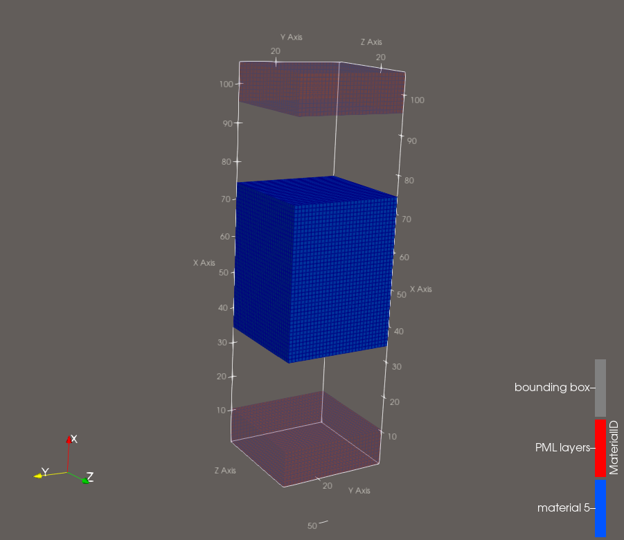
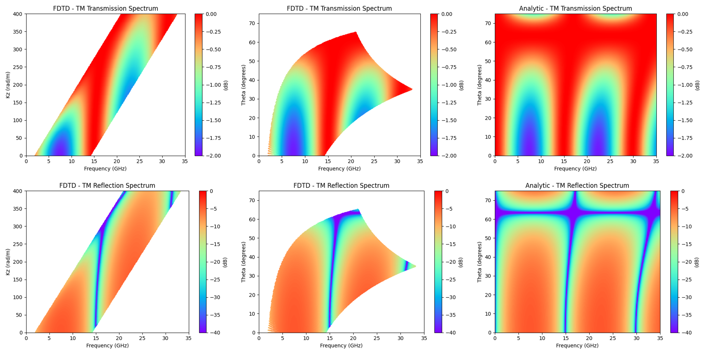
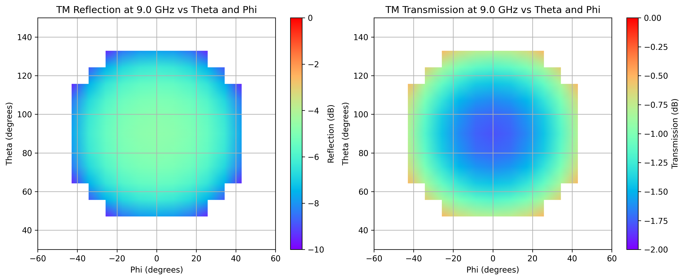

# Oblique Angle TM Transmission and Reflection Through a Quasi-1D Infinite Slab of Dielectric Material (AlpineEM FDTD)
 
This example uses AlpineEM to perform FDTD simulations that calculate the oblique angle transmission and reflection through a quasi-1D infinite slab of material. The slab is infinite in the y and z directions and finite in the x direction. The infinite condition is created using periodic boundary conditions. Because the angles are oblique with respect to the periodic boundaries, the `kmax` variant is required.
 
The example outputs time-domain data for post-processing, along with binary geometry files for the **object** (material present), **clear** (material absent), and **metal** (material replaced with metal) cases.
 
This example is designed to teach and validate the core mechanisms of the solver, including oblique-incidence plane waves with periodic boundary conditions, dielectric materials, and the utility scripts associated with processing `kmax` data. It is highly recommended that you start with the other examples first, as the `kmax` variant can be nuanced and particularly challenging.
 
This FDTD variant uses what is commonly referred to as the constant-k-vector method. Each frequency component of the transmission and reflection extracted from the time-domain simulations corresponds to a different angle of incidence, so additional steps are required after post-processing to understand and visualize the data. Similarly, other S-parameter and far-field quantities (even with the Bloch phase removed) can be hard to interpret meaningfully, so great care must be taken when using the `kmax` variant.
 
## Workflow
 
### 1. Compile the FDTD solver and prepare the batch script
 
Choose one of three build options depending on the resources available to you:
 
- **Single-threaded CPU**
- **Multi-threaded CPU** (OpenMP)
- **GPU** (OpenACC)
Batch scripts are included for building each version: `compile_kmax.sh`, `compile_kmax_mp.sh`, and `compile_kmax_acc.sh`.
 
The example batch script (`run_parallel.sh`) was designed to run many simulations in parallel on an HPC system. Each simulation is small and a single core is sufficient, so only the single-threaded option is demonstrated. The other versions can be used if resources allow.
 
Two examples are demonstrated here. They differ only in the number of cases, the k vectors chosen for each case, and the plotting script used to interpret the results. To run either example, only `run_parallel.sh` needs to be modified. **Example 2 is the default.**
 
- **Example 1:** 400 cases (3 simulations per case: object, metal, and clear). Set the number of simulations to 400, uncomment the line for `parallel_kmax_f_vs_angle.py`, and comment out the line for `parallel_kmax_angle_vs_angle.py`.
- **Example 2:** 225 cases. Set the number of simulations to 225, uncomment the line for `parallel_kmax_angle_vs_angle.py`, and comment out the line for `parallel_kmax_f_vs_angle.py`.
The batch script runs all simulations.

`parallel_kmax_angle_vs_angle.py` and `parallel_kmax_f_vs_angle.py` were slightly modified from the default utility script labeled `parallel_kmax.py` in the utilities folder. 

As in the other example folders, the individual steps are described below.
 
### 2. Run the object case — `master.py`
 
Configures and runs the simulation with the object present.
 
- Generates a text file of inputs, then executes the binary compiled in Step 1.
- You must set the solver name in `master.py` (the single-threaded version is selected by default).
- Produces several output files used for post-processing and geometry viewing.
> **Note:** Run for zero time steps if you want to view the geometry (see Step 6) before running a full simulation.
 
### 3. Run the clear case — `master_clear.py`
 
Performs the same steps as `master.py`, but without the object present, to establish the reference (background) fields.
 
- You must set the solver name in `master_clear.py` (the single-threaded version is selected by default).
- Produces several output files used for post-processing and geometry viewing.
### 4. Run the metal case — `master_metal.py`
 
Performs the same steps as `master.py`, but with the object replaced by metal, providing the last piece needed for TRL calibration.
 
- You must set the solver name in `master_metal.py` (the single-threaded version is selected by default).
- Produces several output files used for post-processing and geometry viewing.
> **Note:** To bypass the metal case, change `use_metal=True` to `use_metal=False` in `post_processor_kmax.py`. Using the metal case provides more accurate results, but it shifts the phase center from the wave port to the surface of the metal.
 
### 5. Post-process — `post_processor_kmax.py`
 
Combines the object, clear, and metal case outputs to generate transmission and reflection data as a `.csv` file.
 
### 6. (Optional) View the geometry
 
To visualize the simulation geometry (which is the same for every k-vector combination):
 
1. Run `fdtd_geometry_maker.py` to generate the ParaView files.
2. Open the resulting **single** ParaView file directly in ParaView. It references an accompanying folder of associated files, so leave that folder in place and do not open its contents individually.
3. For an easier setup, load the included macro, `fdtd_macro.py`, into ParaView (**Macros** tab) to automatically configure common viewing filters.
The ParaView-rendered image is shown below:
 

  

### 7a. Validation — Example 1
 
Use `plot_kmax_f_vs_angle.py` to compare the FDTD result with the analytic result. Make sure the Example 1 settings were selected in `run_parallel.sh` (see Step 1).
 

  

To reach higher angles at the same frequency, either lower the pulse-parameter frequency and use higher k values, or go beyond the 20 dB rule in the post-processor. Data produced and saved beyond that limit is more qualitative and less trustworthy, but it lets you obtain more data and the results are sometimes still reasonable.
 
### 7b. Validation — Example 2
 
Use `plot_kmax_angle_vs_angle.py` to plot the results. Make sure the Example 2 settings were selected in `run_parallel.sh` (see Step 1).
 

  

Although the simulation defines angles for ky and kz outside the range shown, the frequency parameter combined with the 20 dB rule means the data at those angles cannot be trusted, so it is not saved to the `.csv` file. This is why the plots contain white space. As discussed in Step 7a, if you need that data, go beyond the 20 dB rule in the post-processor or lower the frequency parameter and use higher k values.
