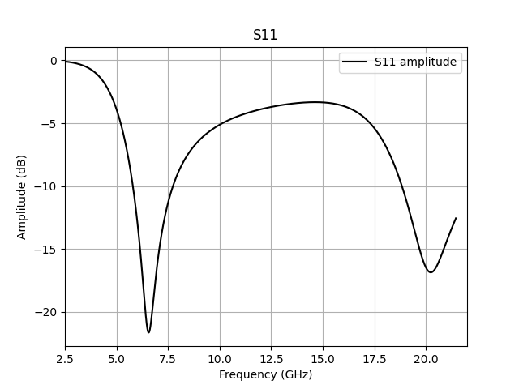
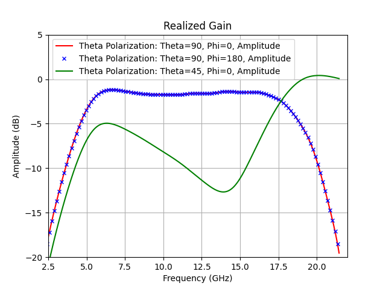
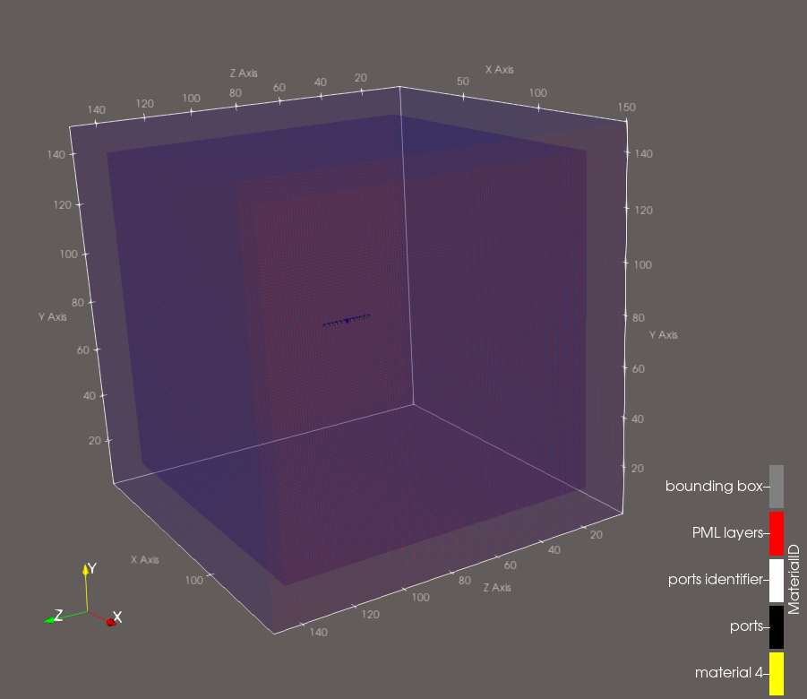

# Radiating Dipole Antenna (AlpineEM FDTD)

This example uses AlpineEM to perform FDTD simulations that calculate the realized gain and reflection coefficient for a radiating dipole-like antenna. It outputs time-domain data for post-processing, along with binary geometry files for the **object** (dipole present) case.

This example is designed to teach the core mechanisms of the solver including basic port types, antenna excitations, and the three builder options (single-threaded CPU, multi-threaded CPU (OpenMP), and the GPU (OpenACC)).

## Workflow

### 1. Compile the FDTD solver

Choose one of three build options depending on the resources available to you:

- **Single-threaded CPU**
- **Multi-threaded CPU** (OpenMP)
- **GPU** (OpenACC)

There are batch scripts included for building all versions (`compile.sh`, `compile_mp.sh`, and `compile_acc.sh`).

### 2. Run the object case — `master.py`

Configures and runs the simulation with the dipole present.

- Generates a text file of inputs, then executes the binary compiled in Step 1.
- You must set the solver name in `master.py` (the default version is selected).
- Produces several output files used for post-processing and geometry viewing.

  > **Note** Run for zero time steps if viewing the geometry (see step 4) is desired before running a full simulation.

### 3. Post-process — `post_processor.py` and `plot.py`

- `post_processor.py` takes the object output to generate realized gain and S parameter data as a `.csv` file.
- `plot.py` plots some of the `.csv` file data.
- Example Slurm batch scripts are included and can be adapted to your cluster environment.

 

  
  

 

### 4. (Optional) View the geometry

To visualize the simulation geometry:

1. Run `fdtd_geometry_maker.py` to generate ParaView files.
2. Open the resulting **single** ParaView file directly in ParaView — it references an accompanying folder of associated files, so leave that folder in place and do not open its contents individually.
3. For an easier setup, load the included macro, `fdtd_macro.py`, into ParaView (**Macros** tab) to automatically configure common viewing filters.

  

> **Note** This example utilizes a basic port type with a size that is 1x1x1 (1 full cell). The user can select sheets, blocks, or lines for the port shape and size.

## Performance reference

Approximate per-simulation runtimes measured on the author's hardware:

| Solver                       | Time per simulation |
|-------------------------------|---------------------|
| OpenACC (GPU)                 | ~30 seconds         |
| OpenMP (multi-threaded CPU)   | ~4 minutes          |
| Single-threaded (default)     | ~8 minutes          |

> **Note:** These timings depend heavily on hardware, problem size, and system load. Use them only as a rough point of reference, not a direct benchmark against other software.
