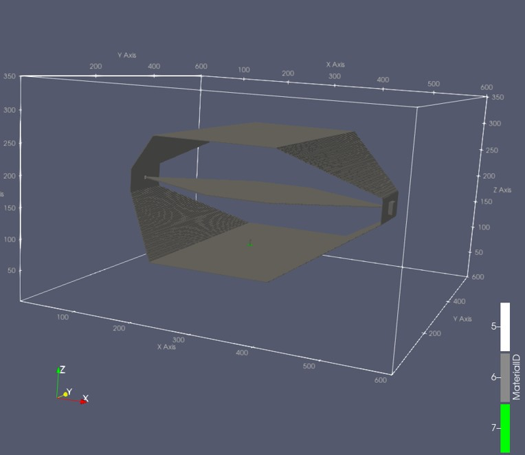

# Three-Port Stripline-Like TEM Waveguide (AlpineEM FDTD)

This example uses AlpineEM's FDTD solver to compute the S-parameters of a 3-port stripline-like waveguide that supports a TEM mode below roughly 250 MHz. Each port is a square, coaxial-like gridded port matched to 50 Ω. In one configuration, a non-Foster circuit sits between port 3 and its 50 Ω load.

It builds on [`/examples/non-Foster_recieving_monopole`](../non-Foster_recieving_monopole) and applies the GTRI method from [1]: the realized gain of an electrically small antenna is extracted from a transmission-line measurement inside a waveguide, then compared with the realized gain from a free-space (infinite ground plane) simulation.

## What this example demonstrates

- Using SPICE circuit elements inside an FDTD simulation
- Using the optional geometry feature
- Defining gridded (coaxial-like) feeds from a statics-solver mask
- Extracting S-parameters from time-domain data
- Cross-validating two very different approaches (waveguide extraction vs. free-space simulation) that should yield the same realized gain

**The two approaches agree closely. The remaining mismatch is most likely due to cell size: halving the cell edge length in each direction (1/8 the cell volume) shifts the free-space results by about 0.5 dB.**

## Workflow

### 1. Compile the FDTD solver

Choose one of three builds depending on your hardware:

| Build | Script |
|---|---|
| Single-threaded CPU | `compile_spice.sh` |
| Multi-threaded CPU (OpenMP) | `compile_spice_mp.sh` |
| GPU (OpenACC) | `compile_spice_acc.sh` |

> **Note:** SPICE must be installed first. Use `build_my_ngspice.sh` or `build_my_ngspice_acc.sh` to install it and export the paths for your chosen build.

> **Warning:** Because of the simulation size, anything other than the GPU (OpenACC) build takes several hours. See [Performance reference](#performance-reference).

### 2. Run the static solver — `square_coax_example.py`

This script calls `EM2Dsolver.py` to solve the 2D statics problem. The resulting weightings also apply to TEM modes when used appropriately.

- It writes a binary file of E- and H-field weightings, which the solver from Step 1 reads directly.
- Set the permittivity and permeability of the 2D geometry to match the shape used in `master.py`.
- The expected output, `gridded_feed_12.bin`, is included for reference.
- The E and H field plots below show voltage and Az (the normal component):

  
  

Wherever the weightings are zero within the mask (outside the coaxial cable), the FDTD solver ignores those cells as part of the port.

The gridded feed file created in [`/examples/non-Foster_recieving_monopole`](../non-Foster_recieving_monopole) is also copied here and used for the monopole port.

> **Note:** The statics solver always treats the z-direction as normal. The mask can still be used when a different direction is normal in the FDTD solver, as it is in this example. The FDTD solver handles this correctly as long as the intended direction is selected in `master.py`.

### 3. Build the waveguide geometry — `make_optional_geom_bulk.py`

This creates a geometry binary that `master.py` reads in. Anything drawn in `master.py` after the import overwrites the corresponding regions of the imported geometry. For example, the coaxial feeds are drawn manually over the waveguide design.

`make_optional_geom_bulk.py` imports a `.npy` file, which can be created with `build_waveguide.py`. That script was generated with AI assistance to approximate the waveguide design from [1] and is not considered a core utility script so it is only found in this folder.

### 4. Run the simulation — `master.py`

This configures and runs the simulation.

- It generates a text file of inputs, then executes the binary compiled in Step 1.
- Set the solver name in `master.py`. The GPU (OpenACC) solver is selected by default because it is much faster.
- When entering gridded feed information, provide the name of the binary from Step 2 and the binary copied from `/examples/non-Foster_recieving_monopole`.
- Several output files are produced for post-processing and geometry viewing.

> **Tip:** To inspect the geometry before committing to a full run, run for zero time steps and then follow [Step 7](#7-optional-view-the-geometry).

### 5. Post-process — `post_processor.py`

This uses the simulation outputs to generate the S-parameter data as a `.csv` file. Example Slurm batch scripts are included and can be adapted to your cluster.

> **Important — impedance normalization:** Because SPICE is used, the post-processor computes with a constant 1 Ω impedance. This is for post-processing only; the correct port impedance is used in the simulation itself. The post-processor has no way of knowing the actual value, so the `.csv` output may need to be corrected for the impedance at each port. A note in the `.csv` header says when normalization is required. The correction is applied in Step 6.

### 6. Compute realized gain and plot — `plot.py`

This script imports the S-parameter `.csv`, applies the impedance correction, converts aperture area to realized gain using the method in [1], and plots the result against the small-cell-size data from `/examples/non-Foster_recieving_monopole`:

  

### 7. (Optional) View the geometry

1. Run `fdtd_geometry_maker.py` to generate ParaView files.
2. Open the resulting **single** ParaView file directly in ParaView. It references an accompanying folder of associated files, so leave that folder in place and do not open its contents individually.
3. For easier setup, load the included macro `fdtd_macro.py` in ParaView (**Macros** tab) to configure common viewing filters automatically.

The rendered geometry looks like this:

  

> **Note:** If the main output file is too large and/or the macro causes issues (long rendering time or too much RAM), the user can go into the folder that accompanies the main Paraview file and load individual portions and/or filter without using the macro.

## Performance reference

Approximate per-simulation runtimes on the author's hardware:

| Solver | Time per simulation |
|---|---|
| OpenACC (GPU) | ~22 minutes |
| OpenMP (multi-threaded CPU) | ~3 hours |
| Single-threaded (default) | ~4 hours |

> **Note:** Because of the domain size and number of time steps, OpenACC was over 10× faster than the default build. Timings depend heavily on hardware, problem size, and system load. Treat them as a rough reference, not a benchmark against other software.

## Other port shapes

This example uses square coaxial-like ports. The [`statics_solver/`](./statics_solver) folder also includes `coax_example.py` for circular coaxial ports. The statics solver accepts any port shape, but square and circular coax are provided as the most common cases.

## References

[1] D. Richardson, J. Dee, J. Yaeger, J. Marsh, R. S. Westafer, "A New Method for Determining Antenna Gain via Transmission Line Based Near Field Measurements in a Waveguide," *Progress In Electromagnetics Research C*, Vol. 155, 61-66, 2025.
