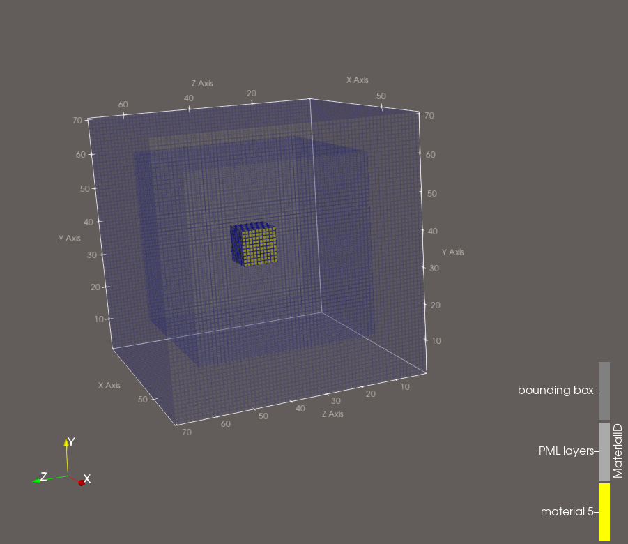
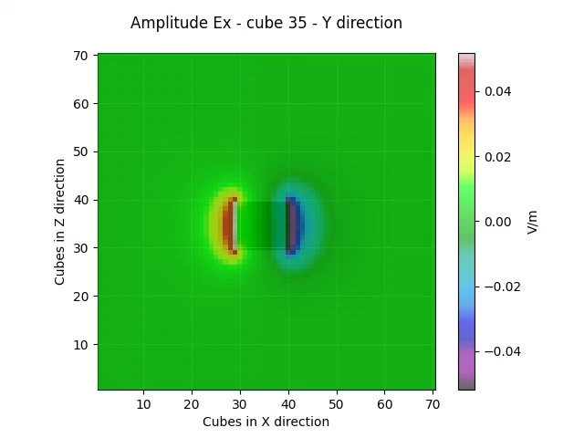
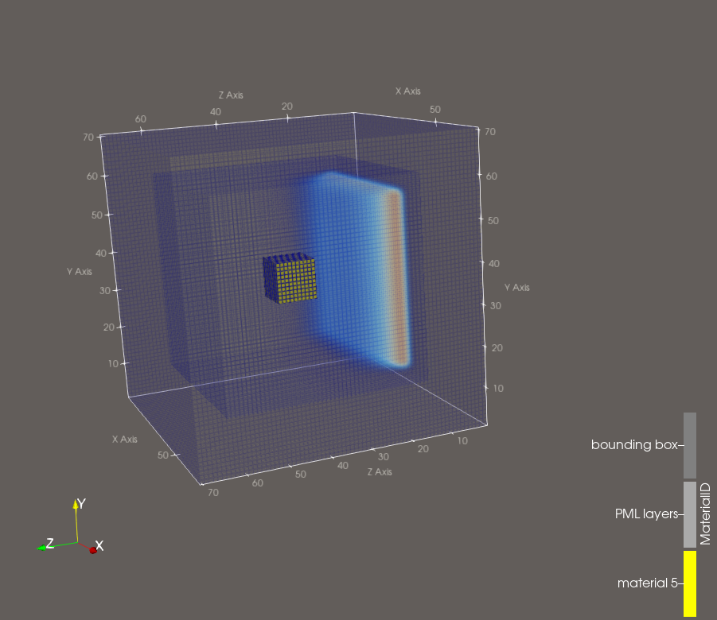
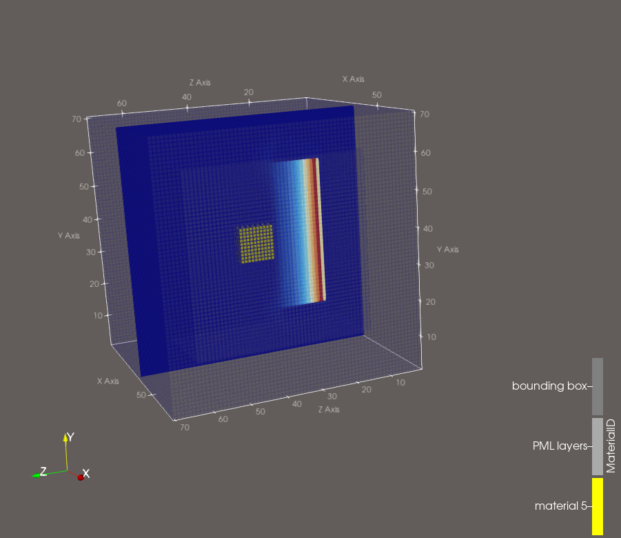

# IN PROGRESS...

# Time and Frequency Electromagnetic Fields Visuatizaion (AlpineEM FDTD)

This example uses AlpineEM to perform FDTD simulations that simulate a plane wave incident on dielectric cube in free space. It outputs electromagnetic (EM) field data for plotting, along with a binary geometry file. Unlike other examples, this example does not post-processor to determine any derived quantities such as S-parameters, realized gain, etc.

The sole purpose of this example if demonstrate the capabilities of the EM field viewer options. A few of the capabilities will be explicitly shown, while many others will just be highlighted. Often times when simulating EM problems, it can be really useful to view the fields in time (or in the frequency domain) to better understand what is phsycially happening within the simulation, even if the derived post-processed quantities are the actual values of interest.

There are two options for fields viewing — a Python viewer for creating videos or still frames of 2D slices (cell centered) and ParaView viewer for creating videos or still frames of the full 3D fields. The ParaView option still uses Python to create ParaView files, similar to the geometry viewer. The ParaView option is the most general, and 2D slices can be created in ParaView as well, but the memory required is much larger.

## Workflow

### 1. Compile the FDTD solver

Choose one of three build options depending on the resources available to you:

- **Single-threaded CPU**
- **Multi-threaded CPU** (OpenMP)
- **GPU** (OpenACC)

There are batch scripts included for building all versions (`compile.sh`, `compile_mp.sh`, and `compile_acc.sh`).

For field viewing, it is often desirable to run shorter simulations, even if longer simulation times are required for accurate post processing. This is because storing all EM field values is costly for both memory and time, and often times viewing fields over shorter time frames can still result in good understandings of the physics. Because of this, there is not a substantial advantage in choosing the higher performance options. However, it should be noted that openMP and openACC might not necessarily be faster for some cases depending on how the EM field memory is distributed and copied back to the host CPU for writing to binary files.

### 2. Run the object case — `master.py`

Configures and runs the simulation with the cube present.

- Generates a text file of inputs, then executes the binary compiled in Step 1.
- You must set the solver name in `master.py` (the default version is selected).
- Produces several output files used for field and geometry viewing.

  > **Note** Run for zero time steps if viewing the geometry (see step 4) is desired before running a full simulation.

### 3.  (Optional) Run the clear case — `master_clear.py`

Performs the same steps as `master.py`, but without the cube present, to establish the reference (background) fields.

- You must set the solver name in `master_clear.py` (the default version is selected).
- Produces several output files used for fields and geometry viewing.

  Example Slurm batch scripts are included and can be adapted to your cluster environment.

### 4. (Optional) View the geometry

To visualize the simulation geometry:

1. Run `fdtd_geometry_maker.py` to generate ParaView files. It will read the FDTD inputs file and the corresponding geometry binary to create the ParaView files.
2. Open the resulting **single** ParaView file directly in ParaView — it references an accompanying folder of associated files, so leave that folder in place and do not open its contents individually.
3. For an easier setup, load the included macro, `fdtd_macro.py`, into ParaView (**Macros** tab) to automatically configure common viewing filters.

  

### 5. Create 2D field slices using the python viewer option — `python_fields_viewer.py`

The top of the script has many options available to the user. Both time and frequency domain (still frame and phasor) are available, with and wihtout the geometry display at the 2D yee cell slice. There are additional settings for viewing the incident or scattered fields only if the clear case was also run. Similarly, there are many options for changing colors and scaling. An example image of the `Ex.mp4` time domain file is shown below. All expected E and H field components are saved here as `.mp4` files for reference.

  

### 6. Create 3D field files using the ParaView viewer option — `paraview_fields_viewer.py`

The top of the script has many options available to the user. Both time and frequency domain are available. There are few settings here as ParaView options are very extensive for modifying what information is viewed and how. It is most convenient to open either a new ParaView instance or go through the geometry file if it is open and viewable, and then to load all time or frequency domain files as one grouped file (this is the default option). From there, it is easy to select slices, volume, ect. or change the colors and scales, or examine magnitude vs component, etc. The possibles are quite large. See ParaView documentation for best practices. An exmample is shown below.

  
  

It is important to note that ParaView often does somewhat odd interpolation schemes or creates seemly uniform but actually nonuniform grids. For example, symmetric fields can easily appear asymmetric if the user is not careful. ParaView is a powerful tool, but does a lot of things under the hood.

## Performance reference

Simulation times are on the order of 10-30 seconds per simulation/script. Additionally, the full 3D fields are approximately 3 GB in total size for all 6 components. The 2D field slices are substantially smaller.

> **Note:** These timings depend heavily on hardware, problem size, and system load. Use them only as a rough point of reference, not a direct benchmark against other software.
