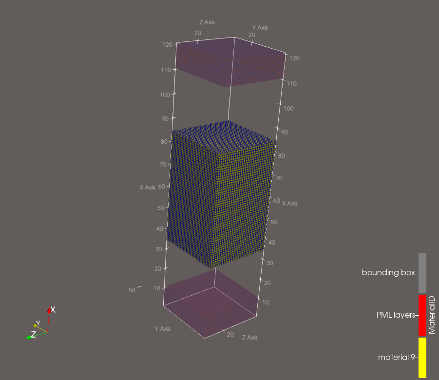
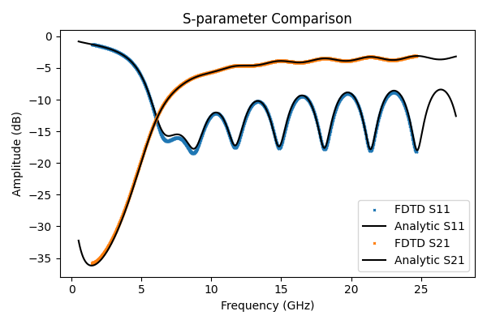

# Transmission and Reflection Through a Quasi-1D Infinite Slab of a 3-Pole Drude (Plasma) Material (AlpineEM FDTD) (In progress...)

This example uses AlpineEM to perform FDTD simulations that calculate the transmission and reflection through a quasi-1D infinite slab of a 3-pole Drude (plasma) material. The slab of material is infinite in the y and z directions, and finite in the x direction. The infinite condition is created using periodic boundary conditions. The slab of material is 50 mm thick (also see Paraview image below). The Drude model supports up to 6 poles, but only 3 are utilized in this example. The 3-pole Drude model used in the example is:

$$
\varepsilon(\omega) = \varepsilon_\infty + \frac{i \sigma_0}{\omega \varepsilon_0} - \sum_{n=1}^{3} \frac{\omega_{p,n}^2}{\omega^2 + i \gamma_n \omega}
$$

| Variable | Physical Meaning | Typical Units |
| :--- | :--- | :--- |
| $\varepsilon(\omega)$ | Complex relative dielectric permittivity | Dimensionless |
| $\varepsilon_\infty$ | High-frequency background dielectric constant | Dimensionless |
| $\sigma_0$ | Static (DC) additive conductivity | $\text{S/m}$ or $\Omega^{-1}\text{m}^{-1}$ |
| $\varepsilon_0$ | Vacuum permittivity ($\approx 8.854 \times 10^{-12}$) | $\text{F/m}$ |
| $\omega$ | Angular frequency of the fields | $\text{rad/s}$ |
| $\omega_{p,n}$ | Plasma frequency of the $n$-th free-carrier channel | $\text{rad/s}$ |
| $\gamma_n$ | Damping rate / collision frequency of the $n$-th channel | $\text{rad/s}$ |

This example outputs time-domain data for post-processing, along with binary geometry files for the **object** (material present), **clear** (material absent), and **metal** (material replaced with metal) cases.

This example is designed to teach and validate the core mechanisms of the solver including normal incidence plane waves with periodic boundary conditions, the multi-pole Drude (plasma) material model, and the three builder options (single-threaded CPU, multi-threaded CPU (OpenMP), and the GPU (OpenACC)).

## Workflow

### 1. Compile the FDTD solver

Choose one of three build options depending on the resources available to you:

- **Single-threaded CPU**
- **Multi-threaded CPU** (OpenMP)
- **GPU** (OpenACC)

There are batch scripts included for building all versions (`compile.sh`, `compile_mp.sh`, and `compile_acc.sh`).

### 2. Run the object case — `master.py`

Configures and runs the simulation with the object present.

- Generates a text file of inputs, then executes the binary compiled in Step 1.
- You must set the solver name in `master.py` (the single-threaded version is selected by default).
- Produces several output files used for post-processing and geometry viewing.

  > **Note** Run for zero time steps if viewing the geometry (see step 6) is desired before running a full simulation.

### 3. Run the clear case — `master_clear.py`

Performs the same steps as `master.py`, but without the object present, to establish the reference (background) fields.

- You must set the solver name in `master_clear.py` (the single-threaded version is selected by default).
- Produces several output files used for post-processing and geometry viewing.

### 4. Run the metal case — `master_metal.py`

Performs the same steps as `master.py`, but the object has been replaced with metal, to finalize the last piece needed for TRL calibration.

- You must set the solver name in `master_metal.py` (the single-threaded version is selected by default).
- Produces several output files used for post-processing and geometry viewing.
- Note: set `use_metal=True` to `use_metal=False` within `post_processor.py` if the user wishes to bypass using the metal case.
- Using the metal case provides more accurate results, but it shift the phase center away from the wave port to the surface of the metal.

### 5. Post-process — `post_process.py`

Combines the object, clear, and metal case outputs to generate transmission and reflection data as a `.csv` file.

- Example Slurm batch scripts are included and can be adapted to your cluster environment.

### 6. (Optional) View the geometry

To visualize the simulation geometry:

1. Run `fdtd_geometry_maker.py` to generate ParaView files.
2. Open the resulting **single** ParaView file directly in ParaView — it references an accompanying folder of associated files, so leave that folder in place and do not open its contents individually.
3. For an easier setup, load the included macro, `fdtd_macro.py`, into ParaView (**Macros** tab) to automatically configure common viewing filters.

The Paraview rendered image is shown below:

  

### 7. Validation

The `plot.py` file can be used to compare the FDTD result with the analytic result:

  

In the 6-9 GHz region, there is slightly disagreement. This is a known and expected feature as the permittivity approaches and equals zero during this transition, making it hard for any solver to accurately resolve the physics.

## Performance reference

Approximate per-simulation runtimes measured on the author's hardware:

| Solver                       | Time per simulation |
|-------------------------------|---------------------|
| OpenACC (GPU)                 | ~22 seconds (clear and metal are faster)      |
| OpenMP (multi-threaded CPU)   | ~3 seconds (clear and metal are faster)           |
| Single-threaded (default)     | ~11 seconds (clear and metal are faster)          |

> **Note:** OpenACC (GPU) performed worse due to the size and scaling of the problem. Unless the simulation is large enough, the overhead required for GPU calculations will dominate. Thus, because this problem utilized a severely non-cubic grid (90x30x30) and was not large in size (total cells and time steps), the GPU case did not dominate. See the monostatic scattering of a sphere example where the GPU handedly dominates the simulation time. These timings depend heavily on hardware, problem size, and system load. Use them only as a rough point of reference, not a direct benchmark against other software.
